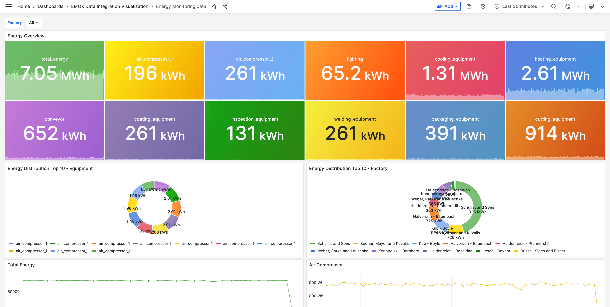

# mqtt-to-timescaledb

Ingesting time series data into TimescaleDB using MQTT and EMQX | MQTT Timescale Integration

## Demo Scenario

This is a SaaS service for IIoT energy consumption analysis.
Each factory has a production line with multiple devices per line. The factory needs to monitor the energy consumption of each device in real time, and analyze the energy consumption of each production line and the entire factory in a certain period of time.

This real-time monitoring and analysis can help factory managers make data-driven decisions, such as identifying equipment failures or abnormal energy consumption, adjusting production schedules to minimize energy consumption, and monitoring and evaluating the effectiveness of energy management measures. To improve energy efficiency and reduce production costs.

<!--  -->

## Introduction

You can use EMQX [data integration](https://www.emqx.com/en/solutions/mqtt-data-integration) or write your own application to achieve this task. This project provides the corresponding sample code.

This tutorial will show you how to use MQTT to ingest time series data into TimescaleDB. We will be using the [EMQX](https://www.emqx.io/) MQTT broker to publish and subscribe to messages. We will also be using the [TimescaleDB](https://www.timescale.com/) database to store the data.

## Init
```
git submodule init
git submodule update
```

## Docker Compose

You can use Docker Compose to quick start this project.

1. Start confluent with Docker Compose:

```bash
docker compose up -d
```

2. View continer status:

```bash
docker compose ps
```

3. You can receive the message from `mqttx/simulate/IEM/{clientid}` topic:

```json
{"factory_id":"056","factory":"Kunze and Sons","values":{"air_compressor_1":3.07,"air_compressor_2":5.19,"lighting":0.96,"cooling_equipment":20.75,"heating_equipment":45.26,"conveyor":8.36,"coating_equipment":4.6,"inspection_equipment":1.8,"welding_equipment":4.88,"packaging_equipment":5.62,"cutting_equipment":15.67},"timestamp":1684145357169}
```

4. Open <http://localhost:3000> in your browser, and login with username `admin` and password `public` to view the Grafana dashboard.



## Prerequisites

| Name      | Version | Description                                                                      |
| --------- | ------- | -------------------------------------------------------------------------------- |
| [EMQX Enterprise](https://www.emqx.com/en/products/emqx)      | 5.0.3+  | MQTT broker used for message exchange between MQTT clients and the TimescaleDB. |
| [TimescaleDB](https://www.timescale.com/)     | latest-pg12+  | IIoT data storage and management, as well as providing time aggregation and analysis capabilities for Grafana.      |
| [MQTTX CLI](https://mqttx.app/cli) | 1.9.3+  | Command-line tool used to generate simulated data for testing.        |
| [Grafana](https://grafana.com/)   | 9.5.1+  | Visualization platform utilized to display and analyze the collected data.       |